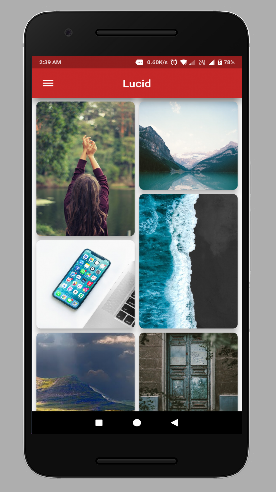
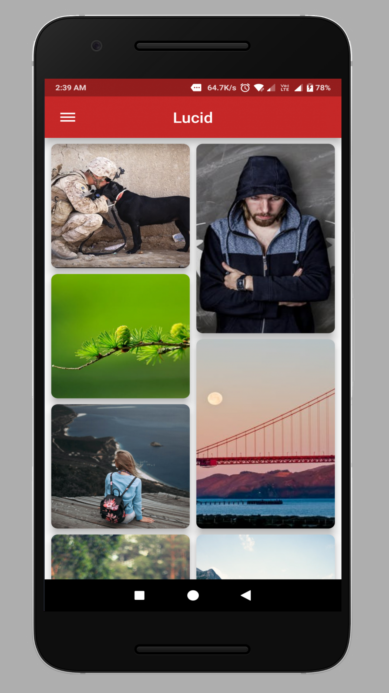
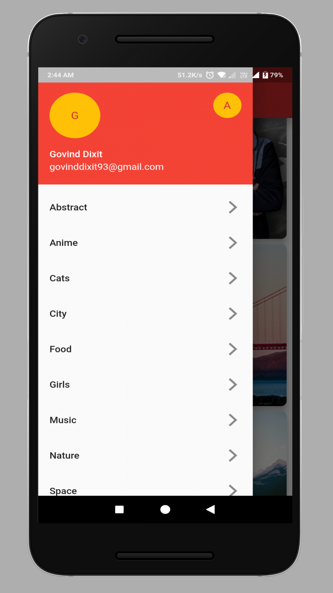
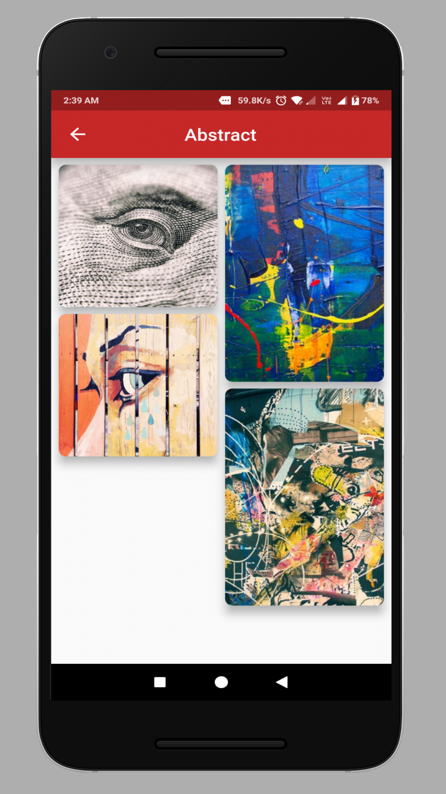

# Lucid

A Wallpaper App with some awesome wallpapers
Made using Flutter framework and dart language

# Screenshots
<table>
   <tr>
      <td></td>
      <td></td>
      <td></td>
  </tr>
   <tr>
      <td></td>
      
  </tr>
</table>

For help getting started with Flutter, view our online
[documentation](https://flutter.io/).
